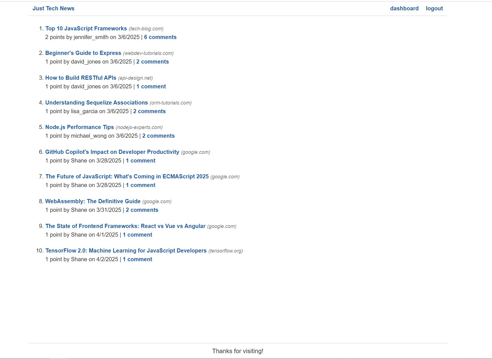

# Just-Tech-News

## Description

Just Tech News — a tech news website where users can post, upvote, and comment on links to news articles. I used Sequelize, an object-relational mapping (ORM) library, to simplify my MySQL queries, add password hashing so that users can create secure passwords, and connected my application to JawsDB, a MySQL add-on for Heroku. This application covered creating and applying middleware functions in Express.js, particularly for route access control. The complete application showcases MVC code organization, using Handlebars.js templates to minimize front-end JavaScript, implementing Handlebars helpers for formatting, and managing back-end session data.

## Requirements

For development, you will only need Node.js.

## Installation

### Node installation on Windows

Please visit [Official Node.js Website](https://nodejs.org/) and download the installer.
Also, be sure to have `git` available in your PATH, `npm` might need it (You can find git [here](https://git-scm.com/)).

To install all node modules and dependencies, please run the command. `npm install`

## Usage

## Deployed Website

### [Deployed Link](https://drive.google.com/file/d/1qffadq7xuJuNY_qgEkqsBWag8jM32fra/view)

## Technologies Used

- JavaScript
- Node.js
- Express.js
- SQL
- Sequelize ORM
- Handlebars.js

## Contributions

- Shane Bramble-Wade

## Project Status

Project is: _completed_

## Contact

Created by [@kranniax](https://twitter.com/kranniax) - feel free to contact me!
